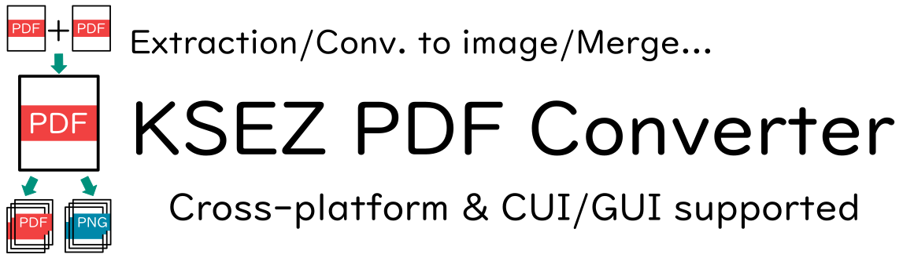

# PDF Converter mk2



PDF Converter using Ghostscript

## どんなソフト

[Ghostscript](https://ghostscript.com/)を用いたPDF変換器です。研究や仕事でPDFをいじることがあるけど、機密上ネットの無料変換サービスは怖くて使えないしめんどくさいというあなたに!

### 嬉しいポイント

- GUI/CUI(コマンドライン)両方で使える
- クロスプラットホーム(Windows/Mac/Linux)対応

## インストール

- 依存・前提条件
  - wxWidgets: GUI
  - Ghostscript

### バイナリファイル

[リリース]()からどうぞ。

### ソースコードを直接コンパイルする

#### Windows

`MSYS2`と`MinGW`を使う。

1. [MSYS2公式HP](https://www.msys2.org/)からMSYS本体をインストール。実行すればあとはNEXT押し続けるだけでおｋ。(インストールの最後で初回起動を有効にしていれば)MSYSが起動する。
2. 初回起動時は以下のコマンドを実行。

```bash
pacman -Syu
```

3. MinGW環境を整備する

```bash
pacman -Sy --noconfirm mingw-w64-x86_64-gcc mingw-w64-x86_64-toolchain mingw-w64-x86_64-cmake make
pacman -Sy --noconfirm mingw-w64-x86_64-wxwidgets3.2-msw   # 依存関係(wxWidgets)
```

4. ビルド

```bash
cd /c/Users/[ユーザー名]/プログラムがあるDirectoryへのパス
build.bat
```

#### Linux

bashスクリプト`./build.sh`を実行する。

```bash
cd /home/[ユーザー名]/プログラムがあるDirectoryへのパス
./build.bat
```

## 使い方

### GUI

起動するだけ

### CUI

コマンドライン叩くだけ

```bash
pdfconv-cui [モード] [入力ファイルパス] (ページ範囲xx-xx,コンマ区切り可) [出力ファイルパス]
```

| モード | 意味 |
| ------ | ---- |
|        |      |

## 生まれた経緯

動機は最初に書いたとおり。初代はすべてpython(PyMuPDF)で実装されていた。が、PySimpleGUIが先日ライセンスが必要となってめんどくさくなったので、フリーなGUIに移行するついでに書き換えることにした。ついでに高速で動いてほしかったのでC++に移行することにした。

## License

MIT license
